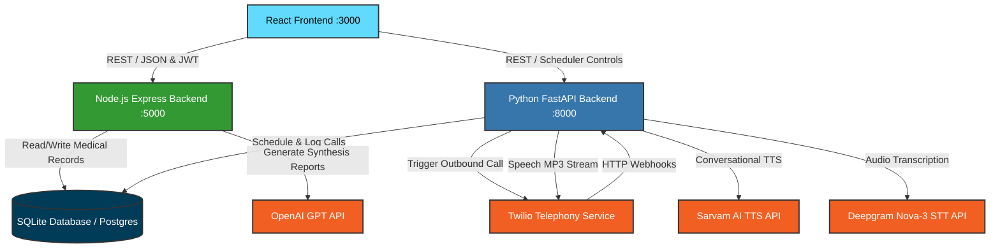
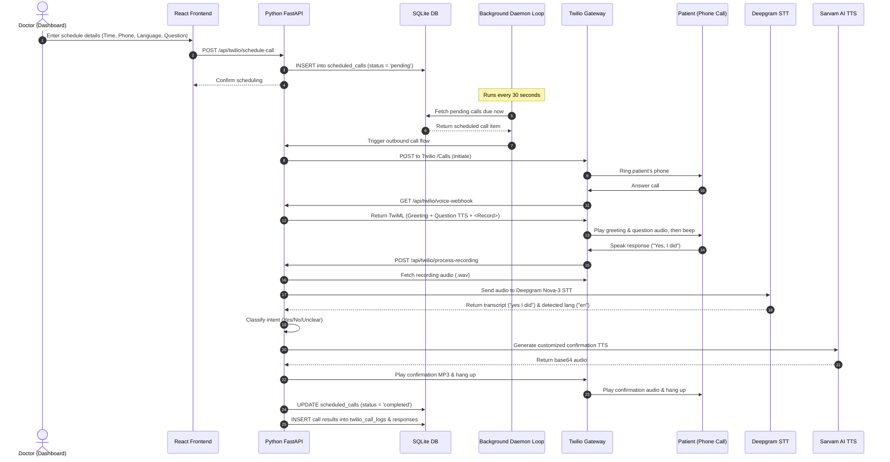

# VocabOPD — AI-Powered Multilingual OPD Management System

<div align="center">
  
  
  
  
  
</div>

An intelligent outpatient department (OPD) management system designed to reduce clinical documentation loads for doctors and ensure medication adherence for patients. It features **voice-powered consultations**, **AI-generated medical reports**, **multilingual speech recognition**, an **automated Twilio-powered Call Scheduler**, and **real-time intent classification**.

---

## 🌟 Key Features

### 🩺 In-Person Clinical Tools
- **Voice-Powered Consultations** — Record doctor-patient clinical conversations in real time using browser or API-based speech-to-text.
- **AI Medical Reports** — Auto-generate formatted, structured medical reports (including Diagnosis, Chief Complaints, Clinical Findings, and Advice) from messy spoken transcripts using OpenAI GPT-4o-mini.
- **Digital Prescription Generator** — Render and download customized, professional digital PDF prescriptions directly from the consultation dashboard.
- **Multilingual Support** — Record and translate consultations seamlessly across 11 Indian languages (English, Hindi, Kannada, Tamil, Telugu, Marathi, Bengali, Malayalam, Gujarati, Punjabi, Odia).

### 📞 Telephony Voice Assistant & Scheduler
- **Interactive Call Scheduler** — Schedule patient phone calls (to the minute) with recurrence patterns (Once, Daily, Weekly, or Custom Weekdays) and set automated Course End Dates directly from the physician's dashboard.
- **Automated Adherence Calls** — A lightweight daemon loop running in the Python backend checks pending schedules every 30 seconds and triggers Twilio outbound calling when the scheduled minute arrives.
- **Natural Multilingual TTS** — Streams natural, human-like voice prompts to patients over the phone using the premium **Sarvam AI Bulbul v3** text-to-speech engine (falls back cleanly to gTTS or Twilio Polly voices).
- **Dual Speech Recognition (STT)** — Patient voice responses are transcribed dynamically using the ultra-accurate **Deepgram Nova-3** multilingual engine or local GPU fallbacks.
- **Real-Time Intent Detection** — Classifies patient answers (e.g., "Yes, I took it", "No, I forgot", "I am feeling dizzy") into structured intents (`Yes`, `No`, `Unclear`), updates adherence statistics on the doctor's dashboard, and delivers responsive spoken confirmations to the patient.

---

## 🛠 Tech Stack

| Layer | Technology | Purpose |
|---|---|---|
| **Frontend UI** | React 19, React Router, Axios, CSS Modules | Physician Portal, Dashboards, and Calling Scheduler |
| **Core API Backend** | Node.js 20, Express.js, JWT, Bcrypt | Auth, Consultation History, AI Reporting, Appointments |
| **Voice AI & Telephony** | Python 3.10+, FastAPI, Uvicorn, SQLModel | Call Scheduler, Twilio Webhooks, Intent Classification, TTS/STT |
| **Telephony Gateway** | Twilio REST API | Outbound Voice Calls, TwiML `<Record>` and Call Hooks |
| **Speech-to-Text (STT)** | Deepgram Nova-3 (Cloud) / IndicConformer + Whisper-Small (Local GPU) | High-speed multi-dialect voice transcription |
| **Text-to-Speech (TTS)** | Sarvam AI Bulbul v3 / gTTS (Google TTS) / Twilio Polly | Realistic multilingual conversational audio generation |
| **LLM & Reasoning** | OpenAI GPT-4o-mini / GPT-4 | Consultation synthesis and structured report generation |
| **Databases** | SQLite3 (Default Local Mode) / PostgreSQL | Dual-engine database architecture for easy local or cloud deploy |
| **Tunneling Gateway** | Ngrok | Exposing local telephony and audio endpoints to Twilio webhooks |

---

## 🧩 System Architecture



---

## 📅 Call Scheduler Lifecycle Flow

The following diagram illustrates how the background daemon process, Twilio API, and AI engines coordinate scheduled adherence checks:



---

## 🚀 Prerequisites & Credentials

Before running the application, make sure you have the following installed and configured:

| Requirement | Description | Check Command |
|---|---|---|
| **Node.js** | v18+ (v20 Recommended) | `node --version` |
| **npm** | v9+ | `npm --version` |
| **Python** | 3.10+ | `python --version` |
| **Twilio Account** | Account SID, Auth Token, and Twilio Phone Number | [Console Dashboard](https://console.twilio.com/) |
| **Ngrok** | Web tunnel to expose localhost to Twilio webhooks | [Downloads Page](https://ngrok.com/download) |
| **OpenAI API Key** | Key for generating clinical PDF reports | [API Keys](https://platform.openai.com/api-keys) |
| **Deepgram API Key** | Nova-3 model key for multilingual speech-to-text | [Console Dashboard](https://console.deepgram.com/) |
| **Sarvam AI Key** | Subscription key for natural Indic TTS voices | [Developer Portal](https://www.sarvam.ai/) |

> [!NOTE]
> The Voice AI Telephony backend (Python) runs in a highly optimized **GPU-free API mode** using Deepgram and Sarvam AI. The local CUDA models (IndicConformer & Whisper-Small) are fully supported as fallback components when run on systems with a `6GB+ VRAM` Nvidia GPU.

---

## 📦 Setup & Installation Instructions

### Step 1: Clone and Navigate
Clone the project repository to your working directory:
```bash
git clone <repository_url>
cd VA
```

### Step 2: Set up the Node.js Data Backend
The Express backend handles user authentication, patient records, clinical history, and AI report configurations.
1. Navigate to the backend folder:
   ```bash
   cd ai_opd_system_react_main/backend
   ```
2. Install Node dependencies:
   ```bash
   npm install
   ```
3. Create a `.env` file in `ai_opd_system_react_main/backend/.env` using the provided example:
   ```env
   # OpenAI Configuration (for AI report generation)
   OPENAI_API_KEY=sk-proj-yourOpenAiKeyHere
   
   # JWT Secret Configuration
   JWT_SECRET=vocabopd_secret_key_2026
   
   # Server Properties
   PORT=5000
   HOST=0.0.0.0
   NODE_ENV=development
   ```

### Step 3: Set up the React Frontend Portal
1. Navigate to the frontend folder:
   ```bash
   cd ../frontend
   ```
2. Install npm packages:
   ```bash
   npm install
   ```

### Step 4: Set up the Python Voice Assistant (Telephony) Backend
This executes scheduled outbound calls, processes recording webhooks, handles speech-to-text transcription, and runs intent classification.
1. Navigate to the root project folder:
   ```bash
   cd d:\PROJECTS\VA
   ```
2. Create and activate a Python virtual environment:
   ```bash
   python -m venv venv
   # On Windows:
   venv\Scripts\activate
   # On macOS/Linux:
   source venv/bin/activate
   ```
3. Install standard required packages:
   ```bash
   pip install -r requirements.txt
   ```
4. Create a `.env` file in the root directory `d:\PROJECTS\VA\.env`:
   ```env
   # Twilio Configuration
   TWILIO_ACCOUNT_SID=ACyourTwilioAccountSid
   TWILIO_AUTH_TOKEN=yourTwilioAuthToken
   TWILIO_PHONE_NUMBER=+1234567890
   
   # Public URL where Twilio can reach your backend webhooks.
   # Copy this from your running Ngrok tunnel (e.g. https://xxxx.ngrok-free.app)
   TWILIO_WEBHOOK_BASE_URL=https://your-ngrok-url.ngrok-free.app
   
   # Deepgram STT Configuration (Cloud Speech-To-Text API)
   DEEPGRAM_API_KEY=yourDeepgramApiKey
   
   # Sarvam AI TTS Configuration (Natural Indian Languages TTS API)
   SARVAM_API_KEY=yourSarvamApiKey
   SARVAM_TTS_SPEAKER=simran
   SARVAM_TTS_MODEL=bulbul:v3
   ```

---

## 🏃‍♂️ Running the Application

To run the entire system, you will need **4 terminal windows** open simultaneously:

### Terminal 1: Ngrok Webhook Tunnel
Twilio requires a public HTTPS URL to contact your local Python callback endpoints. Expose port `8000`:
```bash
ngrok http 8000
```
> [!IMPORTANT]
> Copy the resulting forwarding HTTPS URL (e.g., `https://1234-abcd.ngrok-free.app`) and set it as `TWILIO_WEBHOOK_BASE_URL` in your root `d:\PROJECTS\VA\.env` file. Keep this terminal running!

### Terminal 2: Python Voice AI Backend
Activate the virtual environment and boot up the FastAPI server:
```bash
cd d:\PROJECTS\VA
venv\Scripts\activate
python -m uvicorn backend.main:app --host 0.0.0.0 --port 8000
```
> [!TIP]
> The background call scheduler loop initializes automatically on server boot and polls for pending scheduled calls every 30 seconds.

### Terminal 3: Node.js Core Backend
Navigate to the Node backend and start the server. It will automatically initialize the local SQLite database file `vocabopd.sqlite`:
```bash
cd d:\PROJECTS\VA\ai_opd_system_react_main\backend
node server.js
```

### Terminal 4: React Frontend Portal
Start the React development server to view the main clinical dashboard:
```bash
cd d:\PROJECTS\VA\ai_opd_system_react_main\frontend
npm start
```
Your application portal is now live at **http://localhost:3000**!

---

## 🩺 Doctor & System Usage Guide

### 1. In-Person Patient Consultations
1. Open the portal at **http://localhost:3000** and sign in (or click Register to create a secure doctor profile).
2. Go to **"Start New Consultation"** on the sidebar.
3. Fill in the patient details (Name, Age, Gender, and Preferred Language).
4. Click the **microphone** icon to record the clinical conversation.
5. Use browser-native speech recognition or the robust API transcription endpoints.
6. Review the live transcript, write custom notes, and click **"Save Consultation"**.

### 2. Auto-Generating AI Reports & Prescriptions
1. Navigate to the **"Reports"** page.
2. Select a saved consultation from the list.
3. Click the **"Generate AI Report"** button. The OpenAI model will synthesize the transcript into clinical findings.
4. Modify or confirm the generated chief complaints, diagnosis, and prescription items.
5. Click **"Download PDF"** to save a fully detailed, printer-friendly prescription.

### 3. Smart Call Scheduling & Tracking
1. Go to the **"Voice Assistant / Phone Call"** page.
2. Under **"Schedule Calling"**, choose the patient and their phone number.
3. Select an adherence question (e.g., *Medication adherence, Side effects check, General wellness*).
4. Pick the **Start Time & Date** and set a **Recurrence Interval** (*Once, Daily, Weekly, Custom Weekdays*) along with an optional **End Date**.
5. Choose the **Interaction Language** (e.g., *Hindi, Kannada, English*).
6. Click **"Schedule Call"**.
7. When the scheduled minute arrives, the daemon starts the call. Twilio plays the greeting and question via Sarvam TTS, records the spoken response, transcribes it via Deepgram, classifies the intent (`Yes`/`No`/`Unclear`), plays a conversational confirmation back to the patient, and logs the result to the dashboard database immediately!

### 4. Appointment Filters
- Manage physical checkups under **"Upcoming Appointments"** on the dashboard.
- Quickly sort and filter appointments by:
  - **Today** — See today's schedule at a glance.
  - **Tomorrow** — Prepare for the next day's patients.
  - **Next 7 Days** — Long-term weekly planning.
  - **Later** — View future checkups.
  - **All** — Complete overview of all entries.

---

## ⚡ Available API Endpoints

### 🟢 Node.js Core Backend (Port 5000)

| Method | Endpoint | Description | Authentication |
|---|---|---|---|
| `POST` | `/api/register` | Create a new Doctor Account | Public |
| `POST` | `/api/login` | Authenticate Doctor & Retrieve JWT | Public |
| `GET` | `/api/profile` | Retrieve Doctor Profile Details | JWT Token |
| `PUT` | `/api/profile` | Update Doctor Name, Specialty, or Clinic | JWT Token |
| `POST` | `/api/consultation` | Save a new clinical consultation session | JWT Token |
| `GET` | `/api/history` | Retrieve complete consultation history | JWT Token |
| `GET` | `/api/consultation/:id` | Get individual consultation details by ID | JWT Token |
| `POST` | `/api/ai-report` | Request GPT-4o synthesis for a consultation | JWT Token |
| `PUT` | `/api/consultation/:id/ai-report` | Save finalized AI reports & prescriptions | JWT Token |
| `GET` | `/api/appointments` | Get scheduled physical appointments | JWT Token |
| `POST` | `/api/appointments` | Create a new physical appointment | JWT Token |
| `DELETE` | `/api/appointments/:id` | Remove a scheduled appointment | JWT Token |

### 🔵 Python Voice AI & Telephony (Port 8000)

| Method | Endpoint | Description |
|---|---|---|
| `GET` | `/api/va/health` | Get server status and verify API modes |
| `POST` | `/api/twilio/initiate-call` | Manually trigger an outbound adherence phone call |
| `POST` | `/api/twilio/schedule-call` | Register a new scheduled checkup call in the DB |
| `GET` | `/api/twilio/scheduled-calls` | Retrieve lists of active and past scheduled calls |
| `PUT` | `/api/twilio/scheduled-calls/:id` | Update parameters of a pending scheduled call |
| `PUT` | `/api/twilio/scheduled-calls/:id/cancel` | Mark a scheduled call status as `cancelled` |
| `DELETE` | `/api/twilio/scheduled-calls/:id` | Delete a scheduled call entry permanently |
| `GET` | `/api/twilio/call-status/:log_id` | Get real-time status and logs of a Twilio call |
| `GET` | `/api/twilio/serve-audio/:filename` | Serve generated Sarvam MP3 files directly to Twilio |
| `POST` | `/api/twilio/voice-webhook` | Primary TwiML webhook triggered when a call starts |
| `POST` | `/api/twilio/process-recording` | TwiML webhook processing recorded patient audio |
| `POST` | `/api/twilio/status-callback` | Receives call events (ringing, completed, failed) |

---

## 📁 Directory Structure

```text
VA/
├── ai_opd_system_react_main/
│   ├── frontend/                  # React Frontend Portal
│   │   ├── src/
│   │   │   ├── components/        # Sidebar, Navbar, AudioRecorder UI
│   │   │   ├── pages/             # Dashboard, VoiceAssistant, RecordConsultation, Reports
│   │   │   ├── services/          # API Axios configurations (api.js, voiceAssistantService.js)
│   │   │   └── App.js             # Navigation structure and routing definitions
│   │   └── package.json
│   │
│   └── backend/                   # Node.js Express Data Backend
│       ├── server.js              # Main Express Application & Routes
│       ├── db.js                  # Database connection driver
│       ├── middleware/            # JWT authentication checks
│       ├── services/              # AI reporting, PDF prescription, and Whisper APIs
│       └── package.json
│
├── backend/                       # Python FastAPI Telephony Backend
│   ├── main.py                    # Server Setup, Health Checks, and Routers
│   ├── twilio_calls.py            # Twilio Calls, Call Scheduler, Webhooks, Deepgram/Sarvam TTS
│   ├── twilio_config.py           # Configuration loaders and credentials validation
│   ├── models.py                  # SQLAlchemy Database Schema
│   ├── schemas.py                 # Pydantic Request/Response validation
│   ├── intent.py                  # Regex & keyword-based keyword classifications
│   └── database.py                # Database connection configuration
│
├── dataset/                       # Project datasets (Optional templates)
├── requirements.txt               # Root Python dependencies
└── README.md                      # This main instructions file
```

---

## 🛠 Troubleshooting

### 🔴 Twilio Outbound Calls Fail Instantly
1. **Verify Ngrok Tunnel:** Check that the Ngrok terminal is running on port `8000`.
2. **Match base URLs:** Verify that `TWILIO_WEBHOOK_BASE_URL` in `d:\PROJECTS\VA\.env` matches the running Ngrok HTTPS URL **exactly** (including the `https://` prefix and without trailing slashes).
3. **Phone number format:** Ensure the patient's phone number is entered in complete E.164 format (e.g., `+919876543210`). The backend contains a normalization filter, but incorrect country codes will cause Twilio API rejections.

### 🔴 Database Locks or Missing Columns
- The Express Node backend automatically boots the SQLite database tables. If you encounter any schema errors, run the database migrations or verify that `vocabopd.sqlite` has write permission.
- The Python backend will automatically run migrations to create `scheduled_calls` and `twilio_call_logs` on boot. If tables are missing, delete `healthcare_voice.db` or `vocabopd.sqlite` to let the servers recreate them cleanly on start.

### 🔴 Missing Environment Credentials
- Ensure `OPENAI_API_KEY` is set in `ai_opd_system_react_main/backend/.env` for clinical report synthesis.
- Ensure `DEEPGRAM_API_KEY` and `SARVAM_API_KEY` are configured in `d:\PROJECTS\VA\.env` for multilingual call support. If keys are missing, the telephony backend will output warnings and fall back to Google TTS/Polly and Twilio's default STT.

### 🔴 Scheduler Daemon Process Not Polling
- The background scheduled call loop runs in a daemon thread managed inside `backend/twilio_calls.py`. It starts automatically when `FastAPI` triggers its startup event.
- Ensure the FastAPI server is running in terminal 2 and finishes its boot cycle successfully without crashing.

---

## 📄 License

This project is built for educational, clinical workflow analysis, and research purposes.
